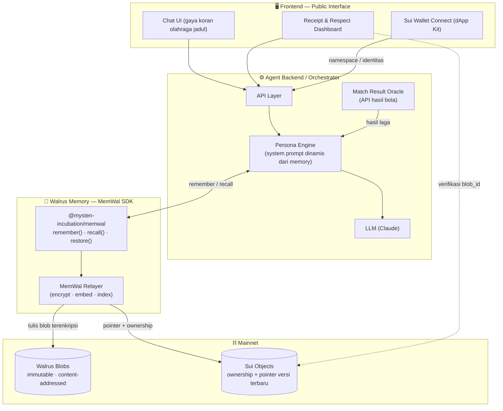
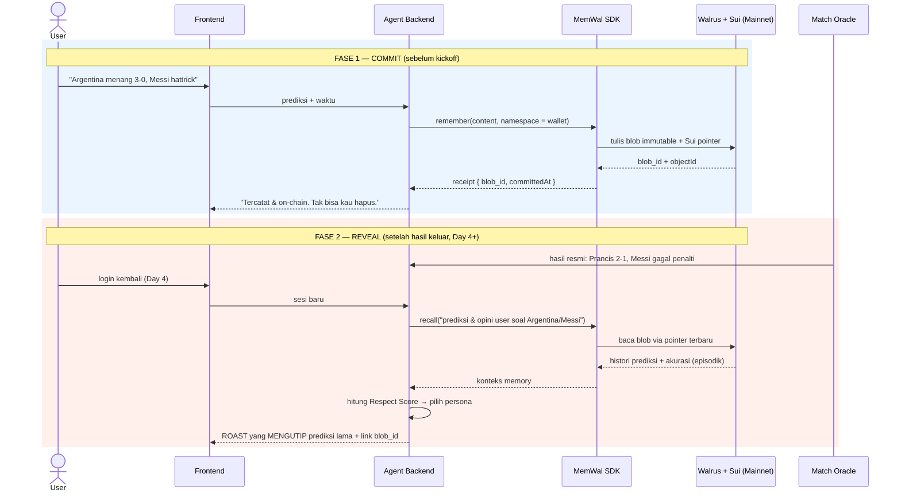
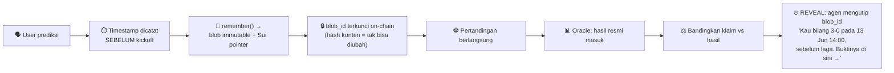
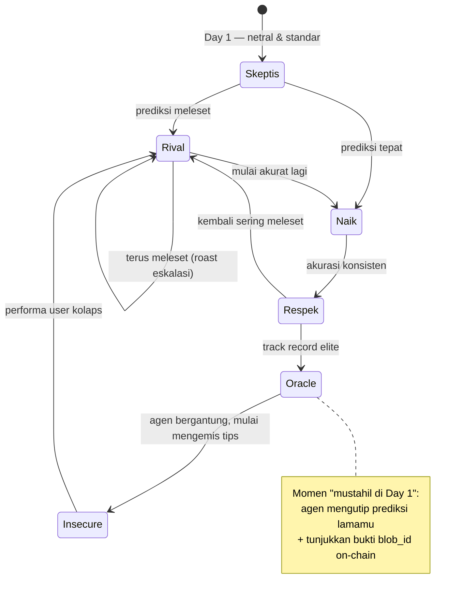
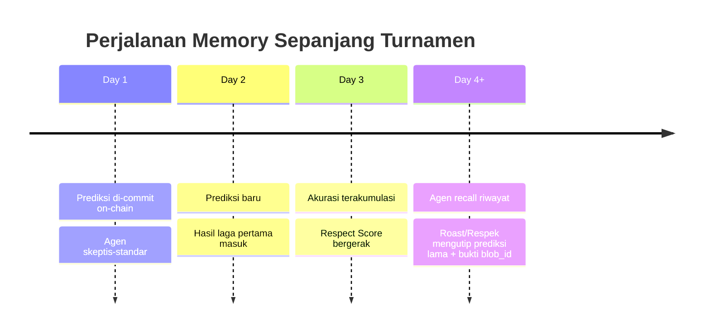
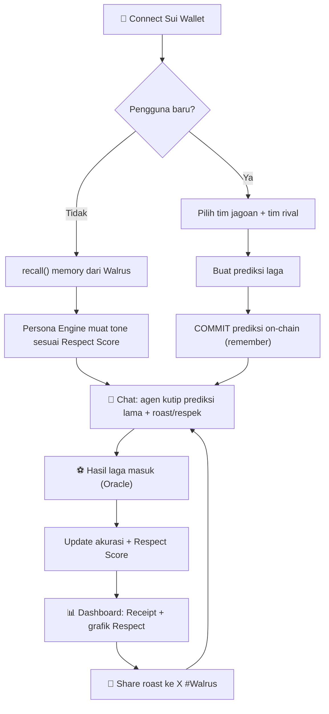
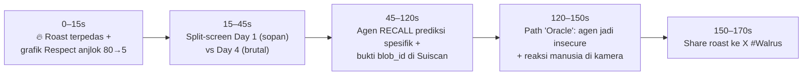
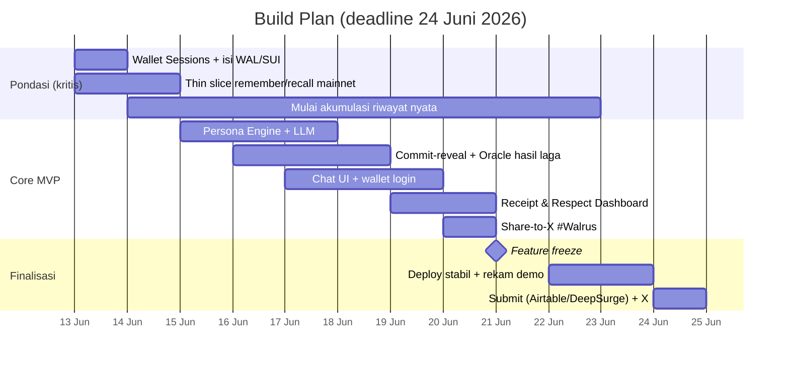

<div align="center">


# 🧠⚽ The Bitter Pundit — *The Receipt*

### Agen AI suporter garis keras yang **menyimpan setiap prediksimu sebagai bukti on-chain yang tak bisa kau hapus** — lalu hubungannya denganmu berevolusi dari meremehkan → respek → bergantung, berdasarkan *track record* yang terbukti.

<br/>

[](https://thewalrussessions.wal.app)
[](https://walrus.xyz)
[-7B61FF)](https://docs.wal.app/walrus-memory/getting-started/what-is-walrus-memory)
[](https://sui.io)
[](https://cakalele.vercel.app)
[](https://cakalele.vercel.app)

</div>

---

## 🔗 Live

| | |
|---|---|
| 🎮 **App (live)** | https://cakalele.vercel.app |
| 🤖 **Agent API** | https://cakalele-production-ab1d.up.railway.app/health |
| 📜 **Contract (Suiscan)** | [`pundit` package](https://suiscan.xyz/mainnet/object/0xe12154f96dd7b13d999d04f69fb792c48ac9b0d82c8eaf2c42ac113f538d136f) |
| 💾 **Repo** | https://github.com/EzraNahumury/cakalele |

---

> **TL;DR** — The Bitter Pundit adalah agen AI berkepribadian pundit sepak bola yang sombong. Bedanya dengan "roast bot" biasa: **setiap prediksimu di-*commit* ke Walrus dengan timestamp SEBELUM kickoff**, jadi agen punya **bukti on-chain** yang tak bisa kau bantah atau edit. Memory-nya **episodik** (mengutip kata-katamu sendiri, bukan sekadar skor), dan **hubungan kalian punya arc**: agen yang awalnya meremehkanmu bisa berubah respek — bahkan jadi *insecure* dan mengemis tips — kalau prediksimu terbukti jitu. Kemenanganmu melawan kesombongannya adalah *game*-nya. Walrus bukan tempelan; ia adalah **buku catatan permanen yang membuat seluruh konsep ini mungkin.**

---

## 📑 Daftar Isi

1. [Masalah & Insight](#1-masalah--insight)
2. [Solusi: The Bitter Pundit](#2-solusi-the-bitter-pundit)
3. [Kenapa Ini Butuh Walrus (Bukan Database Biasa)](#3-kenapa-ini-butuh-walrus-bukan-database-biasa)
4. [Arsitektur Sistem](#4-arsitektur-sistem)
5. [Cara Kerja Memory (MemWal)](#5-cara-kerja-memory-memwal)
6. [Commit–Reveal: Receipt yang Tak Terbantahkan](#6-commitreveal-receipt-yang-tak-terbantahkan)
7. [Evolusi Hubungan — *The Respect Arc*](#7-evolusi-hubungan--the-respect-arc)
8. [Before / After (Memory Depth)](#8-before--after-memory-depth)
9. [Fitur Utama](#9-fitur-utama)
10. [Alur Pengguna (User Journey)](#10-alur-pengguna-user-journey)
11. [Struktur Data Memory](#11-struktur-data-memory)
12. [Tech Stack](#12-tech-stack)
13. [Setup & Menjalankan](#13-setup--menjalankan)
14. [Skenario Demo (3 Menit)](#14-skenario-demo-3-menit)
15. [Roadmap / Build Plan](#15-roadmap--build-plan)
16. [Pemenuhan Requirement Hackathon](#16-pemenuhan-requirement-hackathon)
17. [Kejujuran Teknis & Keterbatasan](#17-kejujuran-teknis--keterbatasan)
18. [Tim, Lisensi & Kontak](#18-tim-lisensi--kontak)

---

## 1. Masalah & Insight

Setiap turnamen besar, jutaan fans membuat prediksi panas di grup chat dan media sosial — lalu **diam-diam menghapus jejaknya** saat prediksi itu meleset. Tidak ada *akuntabilitas*. Tidak ada *receipt*. "Aku kan sudah bilang dari awal!" adalah kebohongan favorit setiap suporter.

> **Insight inti:** Yang membuat banter sepak bola menyenangkan bukan prediksinya — tapi **menagih orang atas prediksi yang mereka coba lupakan.** Itu butuh memori yang *permanen, bertimestamp, dan tak bisa dimanipulasi.* Persis kekuatan inti Walrus.

The Bitter Pundit mengubah ini jadi pengalaman: sebuah agen yang **tidak akan pernah lupa, tidak bisa kau suap, dan punya bukti on-chain.**

---

## 2. Solusi: The Bitter Pundit

The Bitter Pundit adalah agen AI dengan kepribadian **pundit sepak bola arogan-tapi-cerdas** yang menemanimu sepanjang Piala Dunia 2026. Ia melakukan tiga hal yang tidak dilakukan bot prediksi biasa:

| | Bot prediksi biasa | **The Bitter Pundit** |
|---|---|---|
| **Memori** | Logging skor di database | **Memory episodik on-chain** — mengutip prediksi spesifikmu verbatim |
| **Bukti** | "Percaya saja" | **Receipt on-chain** bertimestamp sebelum kickoff (tak bisa di-*backdate*) |
| **Relasi** | Statis | **Arc dinamis** — meremehkan → respek → bergantung (*Respect Score*) |
| **Tujuan user** | Lihat statistik | **Taklukkan kesombongannya** — raih respek lewat prediksi akurat |

**Bukan sekadar di-roast.** Roast hanyalah salah satu kondisi. *Game* sebenarnya: membuktikan pada agen yang sombong ini bahwa kamu layak dihormati. Kalau berhasil, kamu akan melihat momen yang langka & memuaskan — agen yang dulu menghinamu kini **mengakui kamu benar dan mengemis tips prediksi darimu.**

---

## 3. Kenapa Ini Butuh Walrus (Bukan Database Biasa)

Ini pertanyaan terpenting bagi juri: *"Tukar Walrus dengan Postgres — apa yang hilang?"* Jawaban kami konkret:

| Properti | Postgres / DB biasa | **Walrus + Sui** | Kenapa penting di sini |
|---|---|---|---|
| **Immutability** | Bisa di-`UPDATE`/`DELETE` diam-diam | Blob **content-addressed** (`blob_id` = hash konten), tak bisa diubah | Receipt prediksi **tak bisa di-edit** setelah dibuat — pondasi "menagih" |
| **Anti-backdating** | Timestamp bisa dipalsukan server | Di-*commit* on-chain via Sui **sebelum** hasil laga | Membuktikan kamu prediksi sebelum tahu hasilnya |
| **Verifiability** | Harus percaya server kami | Siapa pun bisa verifikasi `blob_id` di Suiscan | User & juri bisa cek bukti sendiri |
| **Persistence** | Hilang kalau server kami mati | Hidup di jaringan terdesentralisasi (per-epoch) | Track record turnamen tetap ada |
| **Auditable history** | Overwrite menghapus jejak | **Append-only** — tiap prediksi blob terpisah | "Receipt" = audit trail nyata, bukan 1 baris yang ditimpa |

> **Kesimpulan:** Konsep inti — *"prediksimu adalah bukti permanen yang akan ditagihkan"* — **tidak mungkin** dengan database mutable biasa. Walrus bukan checkbox hackathon; ia adalah mekanisme yang membuat produk ini bekerja.

### ❌ Anti-pattern yang kami HINDARI (jebakan juri)

Kami **tidak** melakukan `walrus put state.json` lalu meng-*overwrite*-nya tiap sesi. Itu memperlakukan Walrus seperti key-value store mutable — padahal blob Walrus **immutable**, sehingga "overwrite" hanya menghasilkan blob yatim tanpa pointer. Sebagai gantinya kami memakai **MemWal SDK** dengan pola **append-only + namespace + semantic recall** (lihat §5).

---

## 4. Arsitektur Sistem



**Alur singkat:** wallet user → identitas/namespace memory → setiap prediksi disimpan via `remember()` (jadi blob immutable + pointer Sui) → saat sesi baru, `recall()` menarik memory episodik secara semantik → Persona Engine memilih *tone* + mengutip prediksi lama → LLM membalas → Dashboard menampilkan receipt yang bisa diverifikasi on-chain.

---

## 5. Cara Kerja Memory (MemWal)

Kami memakai **Walrus Memory (codename MemWal)** — bukan storage mentah. MemWal menambah **enkripsi, embeddings, dan semantic recall** di atas Walrus, dengan API: `remember()`, `recall()`, `restore()`, `waitForRememberJob()`.



### Contoh integrasi (ilustratif)

> ⚠️ Nama API mengikuti dokumentasi MemWal (status **beta**). Selalu verifikasi terhadap [docs resmi](https://docs.wal.app/walrus-memory/getting-started/what-is-walrus-memory) & [repo MystenLabs/MemWal](https://github.com/MystenLabs/MemWal) saat implementasi.

```ts
import { MemWal } from "@mysten-incubation/memwal";

const mem = new MemWal({
  network: "mainnet",
  signer: sessionKeypair, // wallet khusus Walrus Sessions
});

// ── COMMIT: simpan prediksi sebagai memory episodik (append-only) ──
const { blobId, jobId } = await mem.remember({
  namespace: userWalletAddress,          // isolasi memory per-user
  content: {
    type: "prediction",
    match: "ARG vs FRA",
    claim: "Argentina menang 3-0, Messi hattrick",
    confidence: "high",
    committedAt: timestampSebelumKickoff, // anti-backdating
  },
  tags: ["prediction", "ARG", "messi"],
});
await mem.waitForRememberJob(jobId);       // tunggu blob ter-sertifikasi on-chain

// ── RECALL: tarik memory relevan secara semantik di awal sesi ──
const memories = await mem.recall({
  namespace: userWalletAddress,
  query: "prediksi dan opini user tentang Argentina dan Messi",
  topK: 5,
});
// → memories dipakai Persona Engine untuk roast yang MENGUTIP kata-kata user
```

**Kenapa ini "agent memory" sungguhan, bukan file storage:**
- `recall()` melakukan **semantic retrieval** — agen menarik *opini relevan* ("kamu benci Prancis"), bukan memuat satu blob mentah.
- **Append-only** → tiap prediksi jadi entry terpisah → riwayat lengkap = bahan "Receipt".
- **Namespace per-wallet** → isolasi & ownership memory yang benar.
- Blob **terenkripsi** by default (privasi state psikologis user).

---

## 6. Commit–Reveal: Receipt yang Tak Terbantahkan

Inilah yang membuat roast kami **tidak bisa dibantah**. Karena blob Walrus immutable & bertimestamp on-chain, agen bisa membuktikan kamu membuat prediksi **sebelum** hasil diketahui.



> Tanpa commit-reveal, "receipt" tidak lebih kuat dari baris database. **Dengan** commit-reveal on-chain, agen punya senjata yang mustahil dibantah — dan itu jauh lebih lucu serta lebih kredibel di mata juri.

---

## 7. Evolusi Hubungan — *The Respect Arc*

Memory tidak hanya mengubah *isi* balasan, tapi *kepribadian* agen. **Respect Score** (diturunkan dari akurasi historis yang ter-recall dari Walrus) menggerakkan state machine berikut:



| State | Pemicu | Perilaku Agen |
|---|---|---|
| **Skeptis** | Day 1, belum ada data | Sopan, standar, sedikit meremehkan |
| **Rival** | Akurasi rendah | Arogan, roast (mengutip prediksi gagalmu) |
| **Naik** | Akurasi membaik | Mulai mengakui, tapi gengsi |
| **Respek** | Akurasi konsisten | Menghormati, menyimak analisismu |
| **Oracle → Insecure** | Track record elite | Defensif, bergantung, **mengemis tips** |

> **Retensi via progresi, bukan hukuman.** Roast murni membuat user kabur (kurva kelelahan). Arc "taklukkan kesombongannya" memberi **tujuan** untuk kembali setiap matchday.

---

## 8. Before / After (Memory Depth)

Kriteria #1 hackathon: agen harus melakukan sesuatu yang **mustahil di Day 1**. Inilah kontrasnya:

| Aspek | **Day 1** (tanpa memory) | **Day 4+** (memory ter-recall dari Walrus) |
|---|---|---|
| Sapaan | "Halo. Mau prediksi apa hari ini?" | "Ah, si 'ahli taktik' balik lagi. Masih berani pegang Argentina?" |
| Referensi | Tidak ada | **Mengutip verbatim:** *"4 hari lalu kau bilang 'Messi hattrick lawan Prancis'."* |
| Bukti | — | **Link `blob_id` on-chain** (Suiscan) bertimestamp pra-kickoff |
| Tone | Skeptis-standar | Ditentukan **Respect Score** (Rival / Respek / Insecure) |
| Kemampuan | Generik | **Mustahil tanpa riwayat 4+ hari nyata di Walrus** |



---

## 9. Fitur Utama

- 🧠 **Memory episodik on-chain** — agen mengingat & mengutip prediksi spesifikmu via MemWal `recall()`.
- 🧾 **Immutable Receipt (commit-reveal)** — bukti prediksi bertimestamp sebelum kickoff, tak bisa di-backdate/edit.
- 🎭 **Respect Arc** — kepribadian agen berevolusi (Skeptis → Rival → Respek → Oracle/Insecure).
- 📊 **Receipt & Respect Dashboard** — interface publik: timeline prediksi + grafik Respect, tiap titik bisa di-*trace* ke entry Walrus.
- 🔥 **Shareable Roast** — satu klik bagikan ejekan terpedas ke X dengan **#Walrus** (template terkurasi agar selalu spesifik & tajam).
- 🔗 **Bukti verifiable** — link `blob_id`/Sui object di explorer langsung dari UI.
- 🔐 **Login wallet Sui** — identitas + namespace memory; tanpa email/password.

---

## 10. Alur Pengguna (User Journey)



---

## 11. Struktur Data Memory

Kami memisahkan **entry episodik** (append-only, disimpan permanen) dari **state turunan** (dihitung saat runtime dari hasil `recall()`).

**Entry episodik — satu blob per prediksi (immutable):**
```json
{
  "type": "prediction",
  "match": "ARG vs FRA",
  "claim": "Argentina menang 3-0, Messi hattrick",
  "confidence": "high",
  "committedAt": "2026-06-13T14:00:00Z",
  "wallet": "0xUSER…",
  "tags": ["prediction", "ARG", "messi"]
}
```

**State turunan — dihitung dari banyak entry yang di-recall (tidak disimpan, atau disimpan sebagai snapshot baru):**
```json
{
  "team_loyalty": "Argentina",
  "rivals": ["Prancis"],
  "accuracy_score": "0/3",
  "respect_score": 12,
  "relationship_state": "Rival",
  "last_roasted": "messi_penalty_miss"
}
```

> Setiap update = **blob baru** + pointer Sui ke versi terbaru. Riwayat lama **tetap ada** (audit trail) — itulah yang membuat "Receipt" bermakna.

---

## 12. Tech Stack

| Lapisan | Teknologi |
|---|---|
| **Frontend** | React/Next.js, Sui dApp Kit (wallet), CSS gaya "koran olahraga jadul" |
| **Backend** | Node.js / TypeScript, API orchestrator |
| **LLM** | Claude (persona engine — system prompt dinamis) |
| **Memory** | **MemWal** (`@mysten-incubation/memwal`) — `remember` / `recall` / `restore` |
| **Storage / Chain** | **Walrus Mainnet** (blob) + **Sui** (ownership & pointer) |
| **Data laga** | API hasil pertandingan publik (atau input semi-manual bertimestamp sebagai fallback) |
| **Sharing** | X (Twitter) Web Intent dengan #Walrus |

---

## 13. Setup & Menjalankan

Monorepo: `frontend/` (Next.js app), `backend/` (agent: MemWal + persona/LLM + oracle), `smart-contract/` (Move).
**Live:** app di Vercel, agent di Railway, contract di Sui mainnet. Langkah deploy lengkap: [DEPLOY.md](./DEPLOY.md).

### Backend (agent) — port 8787
```bash
cd backend
npm install
cp .env.example .env     # isi SUI_PRIVATE_KEY (Sessions wallet), OLLAMA_KEY, MEMWAL_* — lihat .env.example
npm run test:memory      # opsional: smoke remember()+recall() ke mainnet, cetak blob_id
npm run serve            # agent → http://localhost:8787  (GET /health, POST /chat)
```

### Frontend (app) — port 3000
```bash
cd frontend
npm install
echo "NEXT_PUBLIC_AGENT_URL=http://localhost:8787" > .env.local
npm run dev              # → http://localhost:3000
```

### Oracle (resolve hasil laga, butuh OracleCap)
```bash
cd backend
npm run oracle -- settle <profileId> <receiptId> <matchId> <correct|wrong> "<hasil resmi>"
```

**Prasyarat:** wallet Sui mainnet (Sessions) terisi **WAL** (storage per-epoch) + **SUI** (gas). Smart contract sudah ter-publish — tak perlu re-deploy (lihat [smart-contract/deployments.mainnet.md](./smart-contract/deployments.mainnet.md)).

---

## 14. Skenario Demo (3 Menit)

Struktur **cold-open** — payoff dulu, baru penjelasan (juri memutuskan dalam 10–15 detik pertama):



**Aturan demo:** jangan simulasi 4 hari dalam satu take. Tunjukkan **dua blob bertimestamp beda** di explorer sebagai bukti before/after genuine. (Karena itu: **mulai pakai agen dengan laga riil hari ini.**)

---

## 15. Roadmap / Build Plan



**Prinsip alokasi waktu: 70% ke jalur Walrus/wallet/on-chain, 30% ke LLM/UI.** Risiko ada di lapisan storage, bukan di prompt.

---

## 16. Pemenuhan Requirement Hackathon

| Requirement | Status | Catatan |
|---|---|---|
| Live di Walrus **Mainnet** + Walrus Memory | ✅ Done | MemWal SDK asli (`remember`/`recall`) di mainnet, account `0x5429…ffc24`, relayer `relayer.memory.walrus.xyz` |
| Genuine persistent memory (mustahil Day 1) | ✅ Done | recall lintas-sesi mengutip prediksi lama user (terverifikasi) |
| Semua state/memory di Walrus | ✅ Done | blob append-only + receipt on-chain anchor `blob_id` |
| Before/after (Day 1 vs Day 4+) | ✅ Done | respect **50/Skeptic → 100/Oracle** setelah 2 resolve; persona berubah |
| Interface publik tempat memory terlihat | ✅ Done | **https://cakalele.vercel.app** — chat + Receipt/Respect dashboard (link Suiscan) |
| Wallet khusus Sessions | ✅ Done | `signalvault` `0xe7d9…1d11` (WAL+SUI), publisher contract |
| Trust-anchor contract live (Sui Mainnet) | ✅ Done | `pundit` PACKAGE `0xe121…136f`, build+8/8 test PASS — lihat [smart-contract/deployments.mainnet.md](./smart-contract/deployments.mainnet.md) |
| Live link (app + agent) | ✅ Done | app Vercel + agent Railway (`/health` 200) |
| Demo video < 3 menit | ⬜ To-do | Struktur cold-open (§14) |
| Submit Airtable + DeepSurge | ⬜ To-do | + nama, logo, deskripsi, website, repo |
| Feedback form + GitHub tickets | 🟡 WIP | bug nyata ditemukan: `@mysten/sui` v2 rename client → MemWal pre-alpha break (jalur Best Feedback) |
| Join Discord + post X #Walrus | 🟡 WIP | Share-to-X bagian core loop |

---

## 17. Kejujuran Teknis & Keterbatasan

Kami sengaja transparan (klaim berlebihan mengundang serangan saat Q&A):

- **Bukan "fully decentralized".** MemWal memakai relayer Mysten + index vektor terpusat; LLM juga terpusat. Yang **on-chain & terdesentralisasi** adalah **blob prediksi + pointer/ownership di Sui** — dan itulah bagian yang penting untuk verifiability receipt.
- **MemWal status beta.** Kami mengantisipasi bug & akan mendokumentasikannya sebagai GitHub tickets (sekaligus memenuhi syarat feedback hackathon).
- **Epoch & biaya.** Penyimpanan butuh WAL/SUI per write; `epochs` disetel agar memory hidup melewati masa penjurian.
- **Guardrail konten.** Persona "arogan" dibatasi agar **tidak** menghasilkan hinaan rasial/nasional — keputusan desain sadar, bukan kelalaian.

---

## 18. Tim, Lisensi & Kontak

- **Tim:** _(isi nama tim & anggota)_
- **Website / Live:** **https://cakalele.vercel.app** · Agent API: `https://cakalele-production-ab1d.up.railway.app`
- **Wallet Sessions:** `0xe7d9532d086478c1e1cc6914e74929814118e4de35ffd8b9a326a0bd8ef91d11` (`signalvault`)
- **Contract (Sui Mainnet):** PACKAGE `0xe12154f96dd7b13d999d04f69fb792c48ac9b0d82c8eaf2c42ac113f538d136f` — [detail](./smart-contract/deployments.mainnet.md)
- **Lisensi:** MIT _(atau sesuai pilihan)_
- **Kontak:** _(isi email / Discord)_

---

<div align="center">

**The Bitter Pundit — *The Receipt***
*Built on Walrus Mainnet · Powered by Walrus Memory (MemWal)*
🐋 #Walrus

</div>
